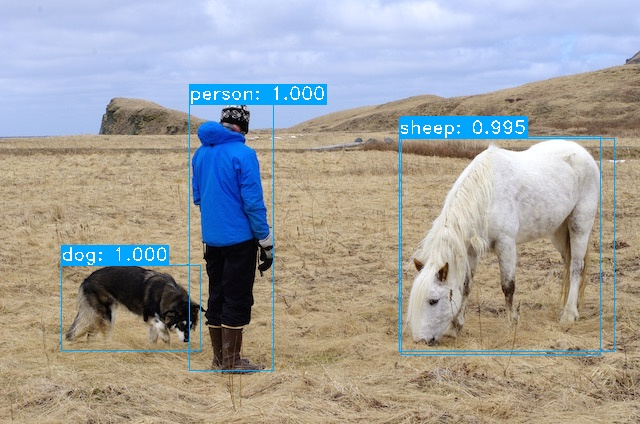
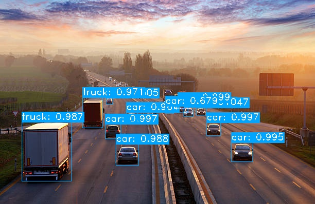
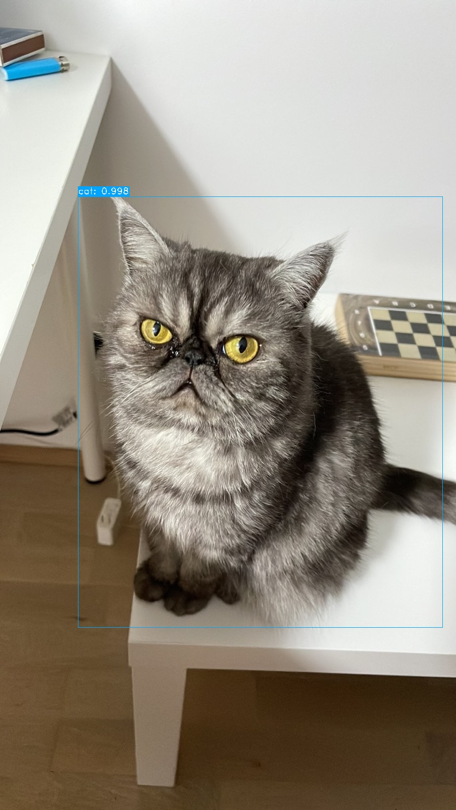

# yolov3-from-scratch
An attempt to implement YoloV3 with pytorch 
Paper: https://arxiv.org/pdf/1804.02767.pdf 
Architecture: https://miro.medium.com/max/720/1*d4Eg17IVJ0L41e7CTWLLSg.webp (source: https://towardsdatascience.com/yolo-v3-object-detection-53fb7d3bfe6b) 
Config files to build the neural net can be obtained from here: https://github.com/pjreddie/darknet/tree/master/cfg 

Current FPS:
- yolov3: <del>0.5, 0.82</del> 0.84
- yolov3-tiny: 8.2

# Test it With Your Images
If you want to play with the code a bit then:
- clone the repo
- run `python detect_image.py --images <path to your image or folder with many images>`
- you will have to download the weights of a pre-trained network e.g., from `https://pjreddie.com/media/files/yolov3.weights`

I'll be working on optimizing the code to improve the FPS which will then be used for online object detection .... for videos.

# Comments
The idea is to build a CNN that takes images split into a 13x13 boxes and outputs a feature map of the same size with with depth B * (5 + C) -> B is is the max number of bounding boxes per section, C is the number of classes and 5 are x,w,h,b, and confidence (objectivness). Thus, per output box we have o = [tx,ty,tw,th,p,c0,...cn]
- we use 416x416 input images with stride 32 thus, the output is 13x13 --total--> 13x13x(Bx(5+C)).
- in yolov3, we use 3 anchors, thus B=3.
- actually the outputs of the network are further transformed to obtain the real coordinates and scales.
    * bx = sig(tx) + offset_x
    * by = sig(ty) + offset_y
    * bw = pw exp(th) # pw is anchor length in w i.e., 13 - check this
    * bh = ph exp(th) # ph is anchor length in h i.e., 13 - check this
- in yolov3, we use sigmoid for the classes to allow for multilabels (e.g., person, woman). Before, softmax was used which doesn;t really allow for double (multi-label) predictions.
- multiscaling: after striding at 32, upsimple again and apply strides 16 and 8, thus getting different grids: 13x13, 26x26 and 52x52 -> this allows detecting smaller objects.
- total boundin boxes for a 416x416 image: (52x52 + 26x26 + 13x13) x 3 = 10647

    * to reduce this number we could: apply a threshold on objectivness, apply NMS (remove boxes predicting same class - keep highest).
- loading the weights of a pre-trained network is difficult. They are stored without any structure!

- shotcut layers: simple summation of feature maps from previous layer (last output) and mentionned layer
- in the default yolov3 config we have 85 attributes and 3 anchors thus, n_filters before yolo layer should always be 255
- we have three yolo layers with the following grids: 19x19, 38x38 and 76x76. This is diffrent than the ones mentionned above because the input size is different (416 and 608)
- total boundin boxes for a 608x608 image: (76x76 + 38x38 + 19x19) x 3 = 10647
- reference for first yolo layer in case of confusion (refer to `others/layer_sizes.txt`): 
    * torch.Size([1, 255, 19, 19]) # before
    * torch.Size([1, 1083, 85]) # after
    * keep in mind that : 
        * 255 = 85x3
        * 1083 x 85 = 255 x 19 x 19
        * 1083 = 19 x 19 x 3

- problem: what if there are two bboxes of same class and overlapping? NMS will remove them
- problem: yolov3-tiny doesn't work (weights can't be loaded)

# Examples

# TODOs
- further optimizations for higher FPS
- batch inference handling
- detections in video
- gpu support